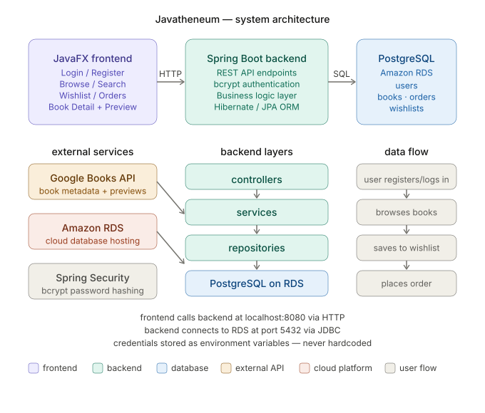

# 📚 Javatheneum

A full-stack digital bookstore with a Windows 98 / vaporwave-inspired desktop UI. Users can create an account, browse a library of real books pulled from the Google Books API, read in-app previews, keep a wishlist, and place orders. All data lives in a PostgreSQL database hosted on Amazon RDS.

Built with a **JavaFX** desktop frontend, a **Spring Boot** REST API, and **PostgreSQL on Amazon RDS**.



## Features

- **Accounts:** registration and login, with passwords hashed using bcrypt
- **Browse by genre:** books organized into horizontal carousels, plus a *Most Popular* row ranked by wishlist count
- **Search:** find books by title or author
- **Book details:** description, page count, price, and an in-app Google Books preview (JavaFX WebView)
- **Wishlist:** save books for later
- **Orders:** place orders and view order history
- **Retro UI:** Windows 98-style windows with a live-clock taskbar

## Tech Stack

| Layer | Technology |
|---|---|
| Frontend | JavaFX 21 (FXML) |
| Backend | Spring Boot 4, Spring Data JPA / Hibernate, Spring Security (bcrypt) |
| Database | PostgreSQL on Amazon RDS |
| External API | Google Books API |
| Language & build | Java 25, Maven (wrapper included) |

## How It Works

The app follows a three-tier architecture:

1. **Frontend (JavaFX):** a desktop app that calls the backend's REST API over HTTP using Java's built-in `HttpClient`.
2. **Backend (Spring Boot):** exposes the REST API, handles authentication and business logic, and follows a controller → service → repository structure.
3. **Database (PostgreSQL on RDS):** stores users, books, wishlists and orders. Hibernate generates the schema and SQL automatically.

Database credentials and the Google Books API key are read from environment variables and never stored in the code.

## Project Structure

```
bookstore_backend/            Spring Boot REST API
└── src/main/java/org/lmdlspfinal/bookstore_backend/
    ├── controllers/          REST endpoints
    ├── services/             business logic + Google Books client
    ├── repositories/         Spring Data JPA repositories
    ├── entities/             JPA entities
    ├── DataLoader.java       one-time book import from Google Books
    └── SecurityConfig.java   bcrypt password encoder

bookstore_frontend/           JavaFX desktop app
└── src/main/
    ├── java/org/lmdlspfinal/bookstore_frontend/
    │   ├── controllers/      one controller per screen
    │   ├── models/           frontend data models
    │   └── services/         ApiService (HTTP calls to the backend)
    └── resources/            FXML layouts and logo

docs/                         architecture diagram
```

## Database Schema

| Table | Purpose |
|---|---|
| `users` | account info (bcrypt-hashed passwords) |
| `books` | book metadata from the Google Books API |
| `wishlists` | users' wishlists |
| `wishlist_items` | books saved to a wishlist |
| `orders` | a user's orders |
| `order_items` | books within each order |

## Running Locally

### Prerequisites

- **JDK 25**
- **PostgreSQL**: an Amazon RDS instance or a local install (e.g. [Postgres.app](https://postgresapp.com))
- **Google Books API key**: from the [Google Cloud Console](https://console.cloud.google.com/apis/library/books.googleapis.com)

Maven itself isn't required; each module includes the Maven wrapper (`./mvnw`).

### 1. Create the database

Connect to your Postgres server and create a database for the app:

```sql
CREATE DATABASE javatheneum;
```

You don't need to create any tables. Hibernate creates them on the backend's first run (`spring.jpa.hibernate.ddl-auto=update`).

> **Using Amazon RDS?** The instance must be *Publicly accessible*, and its security group needs an inbound rule allowing PostgreSQL (port 5432) from your IP address.

### 2. Configure the backend

Set these environment variables, either in your shell or in your IDE's run configuration:

| Variable | Example |
|---|---|
| `DB_URL` | `jdbc:postgresql://<your-endpoint>:5432/javatheneum?sslmode=require` |
| `DB_USERNAME` | your database user |
| `DB_PASSWORD` | your database password |
| `GOOGLE_BOOKS_API_KEY` | your Google Books API key |

For a local Postgres install, use `jdbc:postgresql://localhost:5432/javatheneum` and leave off `sslmode=require`.

### 3. Run the backend

```bash
cd bookstore_backend
./mvnw spring-boot:run
```

The API starts on `http://localhost:8080`.

### 4. Load the book library (first run only)

A new database starts with no books. The importer in `DataLoader.java` is turned off by default so it doesn't run on every start. To fill an empty database:

1. Uncomment `@Component` above `public class DataLoader` in `DataLoader.java`.
2. Restart the backend. It imports books from Google Books in the background (classic literature, science fiction, mystery/thriller and biography) and logs `Done! Total books: …` when finished.
3. Comment `@Component` back out.

The importer only runs when the database has fewer than 10 books, so it won't add duplicates to a library that's already loaded.

### 5. Run the frontend

In a second terminal:

```bash
cd bookstore_frontend
./mvnw javafx:run
```

The frontend expects the backend at `http://localhost:8080`. If your backend runs elsewhere, change `BASE_URL` in `services/ApiService.java`.

## API Reference

| Method | Endpoint | Description |
|---|---|---|
| POST | `/api/users/register` | Register a new user |
| POST | `/api/users/login` | Log in (bcrypt verification) |
| GET | `/api/users/{id}` | Get a user by id |
| GET | `/api/users/username/{username}` | Get a user by username |
| GET | `/api/books` | List all books |
| GET | `/api/books/{id}` | Get a book |
| GET | `/api/books/genre/{genre}` | Books in a genre |
| GET | `/api/books/popular` | Most-wishlisted books |
| GET | `/api/books/search/title?title=` | Search by title |
| GET | `/api/books/search/author?author=` | Search by author |
| POST | `/api/wishlists` | Create a wishlist |
| GET | `/api/wishlists/user/{userid}` | A user's wishlist |
| POST | `/api/wishlist-items` | Add a book to a wishlist |
| GET | `/api/wishlist-items/wishlist/{wishlistid}` | Items in a wishlist |
| DELETE | `/api/wishlist-items/{id}` | Remove a book from a wishlist |
| POST | `/api/orders` | Place an order |
| GET | `/api/orders/user/{userid}` | A user's orders |
| POST | `/api/order-items` | Add a book to an order |
| GET | `/api/order-items/order/{orderid}` | Items in an order |

## Credits

- Book data from the [Google Books API](https://developers.google.com/books)
